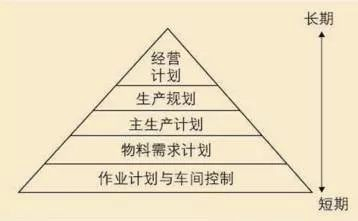

[MES介绍](https://zhuanlan.zhihu.com/p/47880404)

https://www.sohu.com/a/256886521_267417

# 什么是MES系统？
MES(ManufacturingExecutionSystem)即制造企业生产过程执行系统，是一套面向制造企业车间执行层的生产信息化管理系统。MES可以为企业提供包括制造数据管理、计划排产管理、生产调度管理、库存管理、质量管理、人力资源管理、工作中心/设备管理、工具工装管理、采购管理、成本管理、项目看板管理、生产过程控制、底层数据集成分析、上层数据集成分解等管理模块，为企业打造一个扎实、可靠、全面、可行的制造协同管理平台。

# MES 核心功能板块

MES主要管理4种资源，包括生产活动中的人力资源（Personnel Resources）、生产设备（Equipment）、物料和能源（Material and Energy）以及工艺过程链（Process Segments）；在企业经营计划层面与生产过程控制层面之间，实现生产能力信息的交换、产品信息的交换、生产调度信息的交换、生产绩效信息的交换（4P交换功能）。

AMR组织定义的MES有11个功能：

（1）生产资源分配与监控；

（2）作业计划和排产；

（3）工艺规格标准管理；

（4）数据采集（装置在线连接采集实时数据和各种参数信息，控制系统接口，生成生产数据记录、质量数据、绩效信息、台账累计）；

（5）作业员工管理；

（6）产品质量管理；

（7）过程管理（过程控制、APC、基于模型的分析与模拟、与外部解析系统接口）；

（8）设备维护；

（9）绩效分析；

（10）生产单元调度；

（11）产品跟踪。

AMR组织则又把按着11个功能实现的整体解决方案称为MESⅡ（Manufacturing Execution Solution）。其中生产资源计划、排产与调度是主线。如图所示。



1. **生产资源分配与监控**
    ```text
   管理生产所需资源，协调劳动者、生产设备、工具和物料的分配使之最优化，并且跟踪其当前工作状态以及完工情况；
    ```
2. **作业计划和排产**
    ```text
   解决问题：资源约束，均衡生产;快速反应。优化排产;降低库存，减少成本。
   智能排产模块于ERP与MES的应用基础，使得计划与生产一线信息得以实时反馈，从而解决了传统排产软件人工干预比较多的问题，使计划更科学，更合理，更准确，更方便。对接受的订单进行交期承诺，有限产能约束优化生产计划，物料计划及机组作业安排，并将结果下达到MES。同时MES又将生产线发生的实时状态反馈给计划，进行动态调整。
    ```
3. **工艺规格标准管理**

4. **数据采集**（装置在线连接采集实时数据和各种参数信息，控制系统接口，生成生产数据记录、质量数据、绩效信息、台账累计）；
    ```text
   解决问题：实时掌控生产及物流信息、作业指导书集中管理实时更新、增强展示效果提升企业形象等。
   通过PLC单片机或者DCS等采集设备数据（设备参数，运行状态，产品生产数据）。通过PC或手持PDA方式扫码或者人工录入采集工人操作数据。
   电子看板是用于显示当前产线生产进度、良品率等信息，以直观的形式表现在员工面前，便于员工能及时调整或改善生产环境，利于生产水平的提高; 一般用TV或LED屏来作显示设备，也可利用PC来打开系统中的电子看板。
   MES系统看板报表管理模块较为典型的应用包括产线看板、仓库备料看板、会客厅展示看板、工位看板及各类型的统计分板报表。其中工位看板支持DOC、XLS、PDF三种格式文档，服务器对文档进行集中管理和设置，可展示指定文档的某一页，也可以多页轮播等。
    ```
5. **作业员工管理**
    ```text
   提供按分钟级更新的员工状态信息数据（包括工时、参与率、成果确认等）便于指导人员的工作；
    ```
6. **产品质量管理**
    ```text
    解决问题：如何控制(QC)预防出错，异常处理;如何计划;如何改正;品质预警，过程控制，品质分析
    实时分析从制造现场采集到的信息，跟踪和分析加工过程的质量，确保产品品质；
    MES质量管理模块，实现了制造业务和质量管控过程的自然融合，确保了质量活动与制造过程的完美交互，制造过程中所有静态和动态的数据在系统中，
    随着制造业务的开展，自然而然的从各个环节被自动采集，形成庞大的制造数据集合，为质量活动的设计、执行、评价和改进提供了丰富的数据基础;
    系统中的质量管控、质量分析等模块对自动采集得到的海量数据进行筛选、分析与反馈控制，形成数字化为特征的企业车间质量管理体系，
    能够有效提高质量管理活动的执行效率，并使制造过程的质量反应能力和质量控制能力得到极大的提高。
    SPC统计过程控制: SPC应用在现代制造中越来越广泛，随着生产力的进一步发展，大规模生产的形成，如何控制大批量产品质量成为一个突出问题，单纯依靠事后检验的质量控制方法已不能适应当时经济发展的要求，必须改进质量管理方式。而SPC统计过程控制软件则是其中的一个核心工具。SPC管理模块将SPC应用引擎内置于MES系统中，对质量管理提供一个质的飞越。
    ```
7. **过程管理**（过程控制、APC、基于模型的分析与模拟、与外部解析系统接口）；
    ```text
    监控生产过程，指导工厂的工作流程，提高加工效率和质量；
    全生产过程动态跟踪，包括人员操作，设备运行状态，物料出入库及半成品流转移动，间歇式启停等。通过数据分析，输出成本和绩效结果，生产过程数据向业务系统进行输出和记录。
    生产过程管理实现生产过程的闭环可视化控制，以减少等待时间、库存和过量生产等浪费。生产过程中采用条码、触摸屏和机床数据采集等多种方式实时跟踪计划生产进度。
    生产过程管理旨在控制生产，实施并执行生产调度，追踪车间里工作和工件的状态，对于当前没有能力加工的工序可以外协处理。
    实现工序派工、工序外协和齐套等管理功能，可通过看板实时显示车间现场信息以及任务进展信息等。
    ```
8. **设备维护**
    ```text
   解决问题：设备的使用防错，数据收集，状态监控，保养维护、维修、报废等
   追踪设备和工具的保养情况，指导维护工作，保证机器和其他资产设备的正常运转以实现工厂的执行目标；
   本模块较为典型的应用包括印刷机、SPI、贴片机、AOI、回流炉、烧录机、测试测量治具等设备的定期保养维护，稼动率分析，
   使用防错，数据采集，使用次数统计，部分工具的定期校验(内校或外校)等等。
    ```
9. **绩效分析**
    ```text
   将采集上的数据，形成业务描述，再通过产品、生产及过程分析的方式进行数据智能分析，不断完成生产上的工业和质量优化。
    ```
10. **生产单元调度**
    ```text
    通过生产指令将物料或加工命令送到某一加工单元开始工序或工步的操作；
    ```
11. **产品跟踪**
    ```text
    通过监视工件在任意时刻的位置和状态信息来获取每一个产品的历史记录，此记录可向上追踪至材料组件，或追踪至终端成品；
    ```


# 其他IT系统关系
国际上公认的信息化总体架构是原则上将框架划分为3层：PCS层、MES层、ERP层。

**PCS层为底层，以硬设备为主，主要面向操作工人**，实现生产过程操作运转自动化，减少操作工人编制；

**MES层为中间层，承上启下，以生产运行管理软件为主，主要面向生产管理人员**，实现生产管理信息化，以及管理组织的扁平化和紧密化；

**ERP层为最高层，以经营管理软件为主，主要面向经营管理和决策人员**，实现经营决策管理信息化以及管理组织的扁平化和集约化。

近期从最上层分离出决策层，演变成4层结构。突出实时制造性能监控、实时运营智能等管理理念。